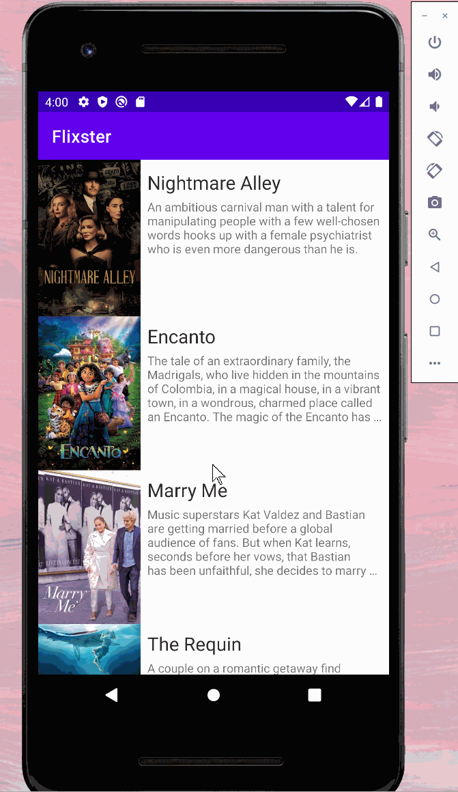
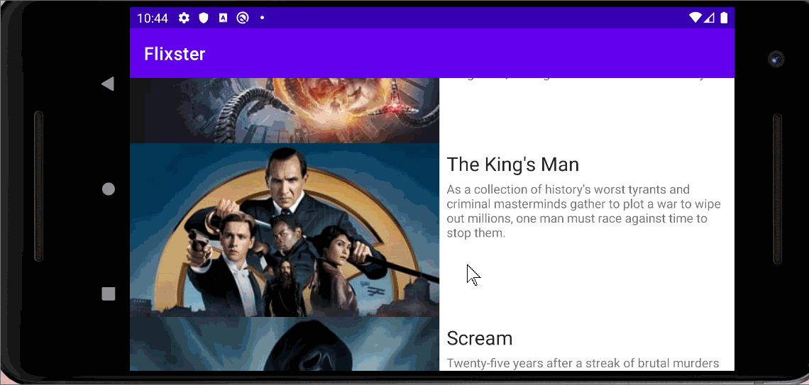

# Flixster

**Flixster** is a Flixster android app clone.

Submitted by: **Weiyi Chen**

Time spent: **2** hours spent in total

## User Stories

The following **required** functionality is completed:

* [ ] User can view a list of movies (title, poster image, and overview) currently playing in theaters from the Movie Database API.
* [ ] Views are responsive for both landscape/portrait mode.

## Video Walkthrough

Here's a walkthrough of implemented user stories:

 

## License

    Copyright [2021] [Weiyi Chen]

    Licensed under the Apache License, Version 2.0 (the "License");
    you may not use this file except in compliance with the License.
    You may obtain a copy of the License at

        http://www.apache.org/licenses/LICENSE-2.0

    Unless required by applicable law or agreed to in writing, software
    distributed under the License is distributed on an "AS IS" BASIS,
    WITHOUT WARRANTIES OR CONDITIONS OF ANY KIND, either express or implied.
    See the License for the specific language governing permissions and
    limitations under the License.
